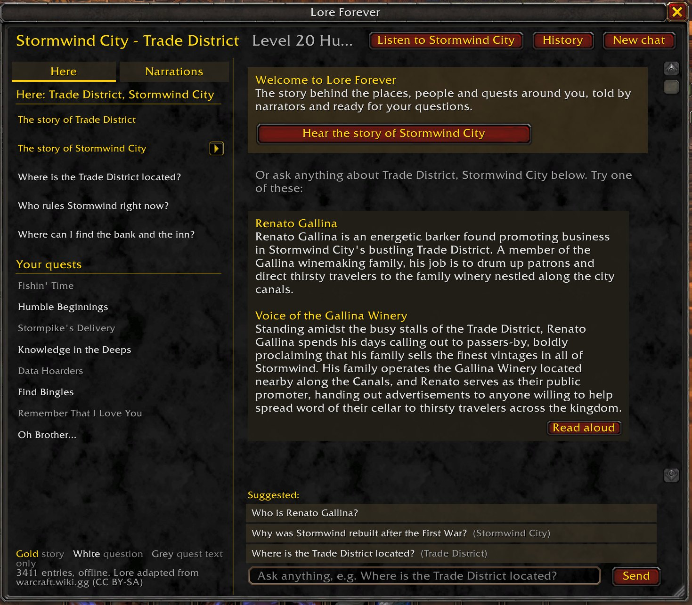

# Lore Forever

The story behind the zones, quests, people and items around you, in game, for **World of Warcraft: Forever**.
Narrated intros for every starting zone, capital and early dungeon, and answers to whatever you ask.

**[Download the installer (Windows)](https://github.com/mliudev/LoreForever/releases/latest/download/LoreForever-Setup.exe)**
· [Zip](https://github.com/mliudev/LoreForever/releases/latest/download/LoreForever.zip) · [Website](https://loreforever.mliu.io) · [CurseForge](https://www.curseforge.com/wow/addons/lore-forever)



## Install

**Installer (Windows):** download
[LoreForever-Setup.exe](https://github.com/mliudev/LoreForever/releases/latest/download/LoreForever-Setup.exe)
and run it. It finds your World of Warcraft folder and puts the add-on in `_classic_beta_\Interface\AddOns`. No
admin rights needed. To update, run the newest installer. The installer is code-signed (publisher: Mei Liu). If
Windows still shows "Windows protected your PC", click **More info**, then **Run anyway**.

**One command (Windows):** press the Windows key, type `powershell`, press Enter, then paste this and press
Enter:

```powershell
irm https://loreforever.mliu.io/install.ps1 | iex
```

It finds your World of Warcraft folder, downloads the latest release from this repo and puts it in
`_classic_beta_\Interface\AddOns`. Run it again any time to update. The script is
[site/public/install.ps1](site/public/install.ps1) if you'd like to read it first.

**By hand:**

1. Download [LoreForever.zip](https://github.com/mliudev/LoreForever/releases/latest/download/LoreForever.zip).
2. Open your WoW folder, then `_classic_beta_\Interface\AddOns` (create `Interface\AddOns` if it isn't there).
3. Unzip it there, so you end up with `...\AddOns\LoreForever\LoreForever.toc`. Watch out for a doubled folder
   like `AddOns\LoreForever\LoreForever\`: that won't load.
4. Start the game and pick a key when it asks, or type `/lore`.

If it doesn't show up: on the character screen, click **AddOns** and tick **Load out of date AddOns**.

To update, download the new zip and unzip it over the old folder.

## What it does

- **Narrated stories.** Every starting zone, capital and early dungeon has a narrated intro, and the questions new
  players ask most have narrated answers. Each people has its own narrator. Anything else can be read aloud with
  the game's text-to-speech voice.
- **Ask in plain English.** "Who is Edwin VanCleef?", "Why is Westfall so poor?" Suggestions appear as you type,
  and every answer offers follow-up questions.
- **Knows where you are.** The panel follows your zone, subzone, target and quest log.
- **Lore on tooltips.** NPCs and mobs get a one-line story; items tell you when one of your quests needs them.
- **Quest backstory.** A Lore button on the quest dialog and quest log.
- **Dungeon primers.** Walk into a dungeon and get a short briefing: why you're there and who you'll face.
- **Spoiler-safe.** Answers that give away a twist ask first, and tooltips never mention quests you don't have yet.
- **Offline.** Everything is inside the add-on. Nothing to sign up for.

Covers every zone, city and dungeon up to level 30, Zephras Isle, the Hall of Thanes and the Ruins of Lordaeron,
plus place lore for the rest of the world: about 3,460 entries, 43 narrated intros and 109 narrated answers.

| Command | What it does |
| --- | --- |
| `/lore` or `/lf` | Open or close the panel |
| `/lore <question>` | Ask straight from chat |
| `/lore narrations` | Every narrated story, your starting area first |
| `/lore key` / `/lore key narrate` | Choose the key that opens the panel / plays narration |
| `/lore stop` | Stop any narration |
| `/lore options` | Settings |
| `/lore help` | All commands |

## What's in this repo

| Path | What |
| --- | --- |
| `addon/LoreForever/` | The add-on, exactly as it's installed. Plain Lua, no libraries. |
| `addon/LoreForever/Data/` | The lore library and its search index, compiled from `data/`. |
| `data/lore/` | Every lore entry as JSON (one file per zone, quest, NPC, place or topic), with its wiki sources. |
| `data/overrides/`, `data/spoilers.json` | Hand-made corrections and the list of answers held behind a spoiler warning. |
| `site/` | The website ([loreforever.mliu.io](https://loreforever.mliu.io)). |
| `scripts/build-release.sh` | Builds the download zip into `dist/`. |
| `release/installer/` | The Windows installer (Inno Setup). |
| `.github/workflows/release.yml` | On a version tag, builds the zip and the installer and publishes the release. |
| `scripts/install-addon.sh` | Copies the add-on into your Forever install from WSL (set `WOW_DIR` if it isn't found). |

The data files are built with a separate tool that isn't part of this repo, so fixes to lore text are best sent
as issues. Code fixes are welcome as pull requests.

## Feedback

Found a wrong answer, or want a zone narrated? Use the [feedback form](https://loreforever.mliu.io/feedback) (no
account needed) or [open an issue](https://github.com/mliudev/LoreForever/issues).

## License

- **Code** (the `.lua`, `.xml` and `.toc` files, scripts and site code): MIT. See [LICENSE](LICENSE).
- **Lore text** (`data/` and `addon/LoreForever/Data/`): adapted from the [Warcraft Wiki](https://warcraft.wiki.gg)
  and shared under [CC BY-SA 4.0](https://creativecommons.org/licenses/by-sa/4.0/). Each entry names its source
  articles.
- **Narration audio** (`addon/LoreForever/Audio/`, `site/public/audio/`) and the **logo**: all rights reserved.
  They ship with the add-on for you to use in game, but please don't reuse them elsewhere.

World of Warcraft and Warcraft are trademarks of Blizzard Entertainment, Inc. Lore Forever is a fan project and
is not affiliated with or endorsed by Blizzard.
